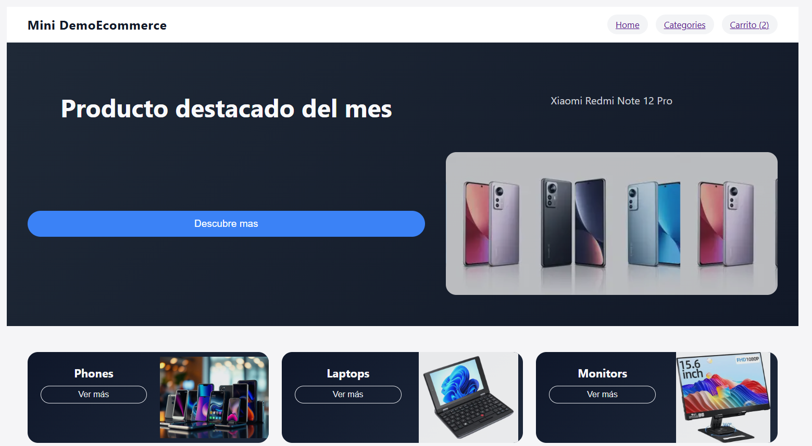
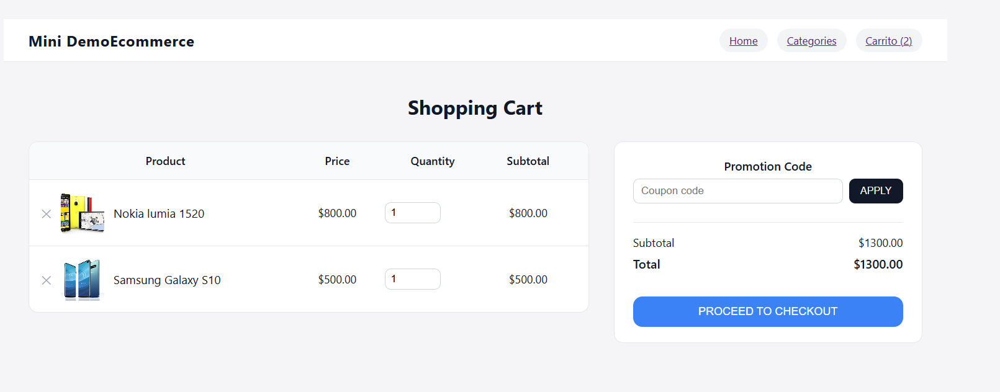
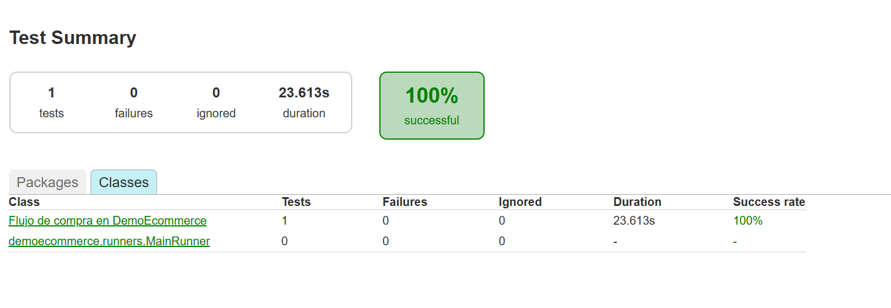

# DemoEcommerce

Full-Stack Application · Monorepo · QA Automation


---

## What this is

DemoEcommerce is a monorepo simulating a complete e-commerce purchase flow, built to practice and demonstrate full-stack development, REST API design, layered backend architecture, and end-to-end QA automation. It integrates:

- A Laravel REST API backend, structured with a Domain/Application/Infrastructure layering (see [Backend Architecture](#backend-architecture))
- A React + TypeScript SPA frontend
- Token-based authentication via Laravel Sanctum
- PostgreSQL for persistence
- Automated E2E testing with Selenium + Cucumber + Serenity BDD (Java)
- A fully containerized dev environment via Docker Compose

## Live demo

Not yet deployed. The project currently runs locally via Docker Compose — see [Local Setup](#local-setup) below. A hosted demo is planned; this section will be updated with the link once available.

## Features

**Working today:**
- Product catalog with categories
- Products filtered by category
- Cart persisted in browser `localStorage`
- Login with token-based authentication (Laravel Sanctum)
- Authenticated checkout and order creation
- Centralized REST client and environment configuration on the frontend
- Strict-mode TypeScript across the frontend

**Not yet implemented:**
- Product detail page
- User registration exposed as a public-facing flow (see [Known Issues](#known-issues) — backend logic exists but isn't confirmed wired to a public route yet)

## Backend Architecture

The backend is not a conventional flat Laravel MVC app — it follows a Domain-Driven / hexagonal layering to separate business rules from framework concerns:

```
backend/app/
├── Domain/           Framework-agnostic business rules: Entities, Repository
│                     interfaces, Services, Enums. No Laravel/Eloquent dependency.
├── Application/      Use cases as Commands + Handlers (CQRS-style). Orchestrates
│                     Domain objects to fulfill a specific action.
├── Infraestructure/  Concrete implementations of Domain repository interfaces,
│                     using Eloquent models and Postgres.
├── Http/             Controllers, Middleware, Form Requests. Thin layer that
│                     translates HTTP into Application commands.
└── Providers/        Laravel service bindings.
```

Example request flow — placing an order:

```
OrderController
    → CreateOrderCommand
    → CreateOrderHandler                  (Application layer)
    → Domain\Orders\Entities (Order, OrderItem)   (Domain layer)
    → EloquentOrderRepository              (Infrastructure layer)
    → PostgreSQL
```

This adds structure at the cost of more files for a project this size — see [Key Decisions](#key-decisions-and-tradeoffs) for why.

## Frontend Structure

```
frontend/src/
├── api/           One module per resource (auth, categories, products, orders) —
│                  each knows its own endpoints, nothing else.
├── shared/
│   ├── api/       apiClient.ts — centralizes base URL, headers, auth token,
│   │              fetch execution, and JSON/error handling.
│   └── config/    env.ts — centralizes environment variables.
├── models/        Shared TypeScript types (e.g. Product), decoupled from raw
│                  API response shapes.
├── pages/         Route-level components.
├── components/    Reusable UI building blocks.
├── hooks/         Custom React hooks (e.g. useAuth).
└── validators/    Client-side input validation.
```

Request flow example:
```
CategoryProductsPage → products.ts → apiClient.ts → Laravel API
```
Pages never call `fetch()` directly — everything goes through `apiClient.ts`, which is the only place that knows about auth headers, base URLs, and HTTP error handling.

The API layer also normalizes response data before it reaches components — for example, Laravel may return `price` as a string (`"19.99"`), which `products.ts` converts to a `number` before handing it to the `Product` model used throughout the frontend.

## API Endpoints

Base path: `/api/v1`

### Public

| Method | Endpoint | Description |
|---|---|---|
| GET | `/categories` | List categories |
| GET | `/categories/{id}/products` | Products in a category |
| GET | `/products` | List products |
| GET | `/products/{id}` | Get product by ID |
| GET | `/products/slug/{slug}` | Get product by slug |
| POST | `/auth/login` | Authenticate, returns Sanctum token |

### Authenticated (Bearer token required)

| Method | Endpoint | Description |
|---|---|---|
| POST | `/orders` | Create an order |

> Authenticated requests: `Authorization: Bearer <token>`. A role-checking middleware (`EnsureUserHasRole`) exists in the codebase for role-gated routes — currently no endpoints in `routes/api.php` are confirmed to use it; update this table if/when one does.

## Authentication

```
User
  → POST /api/v1/auth/login
  → Laravel validates credentials
  → Sanctum issues a token
  → Frontend stores the token
  → apiClient attaches it as a Bearer header on subsequent requests
  → Protected endpoint validates the token before responding
```

## Local Setup

### Prerequisites
- Docker Desktop (with WSL2 backend enabled, on Windows — this is required, not optional)
- Git

### 1. Clone and configure environment
```bash
git clone <repo-url>
cd demo-ecommerce
```

There is currently no `.env.example` committed (see [Known Issues](#known-issues)). Create `backend/.env` manually with the following, which matches `docker-compose.dev.yml`:

```env
APP_NAME=DemoEcommerce
APP_ENV=local
APP_KEY=
APP_DEBUG=true
APP_URL=http://localhost:8080

DB_CONNECTION=pgsql
DB_HOST=db
DB_PORT=5432
DB_DATABASE=demoecommerce
DB_USERNAME=demo
DB_PASSWORD=secret

SESSION_DRIVER=file
CACHE_STORE=file
QUEUE_CONNECTION=sync

SANCTUM_STATEFUL_DOMAINS=localhost:5173
SESSION_DOMAIN=localhost
```

The frontend needs no separate `.env` — its variables (`VITE_API_URL`, `VITE_SERVER_BASE_URL`) are injected directly by `docker-compose.dev.yml`.

### 2. Start the stack
```bash
docker compose -f docker-compose.dev.yml up --build
```
This builds and starts Postgres, the Laravel backend, Nginx (API gateway), and the Vite dev server.

> **Note:** as shipped, the `backend` service's bind mount masks the `vendor/` directory installed during the image build, which breaks `php artisan` commands run via `docker compose exec`. The same issue existed for the frontend's `node_modules` and was fixed by adding an anonymous volume. See [Known Issues](#known-issues) for the fix needed on the backend service.

### 3. Generate the app key
```bash
docker compose -f docker-compose.dev.yml exec backend php artisan key:generate
```

### 4. Run migrations and seed the database
```bash
docker compose -f docker-compose.dev.yml exec backend php artisan migrate --seed
```
Seeds categories, products, and an admin user (`AdminUserSeeder`).

### 5. Verify
- Frontend: http://localhost:5173
- API: http://localhost:8080/api/v1/products

## Production-style Build

```bash
docker compose -f docker-compose.dev.yml down
docker compose -f docker-compose.prod.yml up --build
```
In this mode, the frontend is compiled to static files via `npm run build` (Vite output in `dist/`) and served through Nginx, rather than running the Vite dev server.

```
dev:   React source → Vite dev server        → Browser
prod:  React source → Vite build → dist/     → Nginx → Browser
```

## Testing

**Backend:** PHPUnit is configured (`phpunit.xml`), but `tests/Feature/ExampleTest.php` and `tests/Unit/ExampleTest.php` are Laravel's default scaffold tests — real backend test coverage is not yet written. Once the Docker `vendor/` mount issue above is fixed, run with:
```bash
docker compose -f docker-compose.dev.yml exec backend php artisan test
```

**QA Automation (E2E):** A working Selenium + Cucumber + Serenity BDD suite exists in `qa-automation/`, covering the full purchase flow (home → browse → add to cart → checkout → confirm). To run it:
```bash
cd qa-automation
./gradlew test        # or gradlew.bat test on Windows
```
Requires JDK 17+ (`JAVA_HOME` set) and the app stack running via Docker Compose first, since it drives a real browser against the live local app. Check `build.gradle` to confirm the exact Serenity report output path (typically `target/site/serenity/index.html` or `build/reports/`) — see [Known Issues](#known-issues).

## CI/CD

Not yet implemented. Planned: GitHub Actions running backend tests, the QA suite, and a build check on every PR — see [Roadmap](#roadmap).

## Key Decisions and Tradeoffs

- **DDD/hexagonal backend structure over plain Laravel MVC** — chosen deliberately as a learning goal and to demonstrate separation of business logic from framework code, at the cost of more files/boilerplate than a project this size strictly needs.
- **Selenium + Cucumber + Serenity (Java) for QA**, rather than a JS-based E2E tool that would match the rest of the stack — chosen to demonstrate BDD-style test automation and Java tooling specifically as a QA skill, independent of the app's own language choices.
- **Cart persisted in `localStorage`** rather than the database — simpler for a demo project where cart state doesn't need to survive across devices or sessions server-side.
- **Product detail page and public user registration deprioritized** — checkout and the core purchase flow were treated as the critical path; these were consciously scoped out for now rather than left unplanned.

## Known Issues

- **Backend `vendor/` masked by Docker bind mount:** `docker compose exec backend php artisan ...` currently fails with a missing `autoload.php` error, because the bind mount `./backend:/var/www` hides the `vendor/` directory installed at image build time. Fix: add `- /var/www/vendor` as an anonymous volume under the `backend` service in `docker-compose.dev.yml` (same pattern already applied to `frontend`'s `node_modules`). Identified but not yet applied/committed as of this writing.
- **No `.env.example` committed** — required variables are documented above in [Local Setup](#local-setup) instead.
- **QA suite run command not fully end-to-end verified against this repo** — `./gradlew test` is the expected Serenity/Cucumber convention, but hasn't been confirmed to run without error including the exact report output path.
- **No live deployment yet.**
- **User registration:** backend command/handler code exists (`RegisterUserCommand`, `RegisterHandler`, `RegisterRequest`), but it's unconfirmed whether a route in `routes/api.php` currently exposes it.

## Roadmap

**Backend:** user registration route, backend unit/feature test coverage, expanded validation.
**Frontend:** product detail page, global error handling, runtime validation of API responses.
**QA:** API-level testing, expanded E2E coverage, performance testing.
**DevOps:** fix Docker `vendor/` mount, add `.env.example`, GitHub Actions CI/CD, quality gates, production deployment.

## Screenshots

### Home


### Cart


### Automated Test Report


## About

Built as a portfolio project to practice and demonstrate full-stack development, REST API design, layered backend architecture, QA automation, and containerized local environments.
